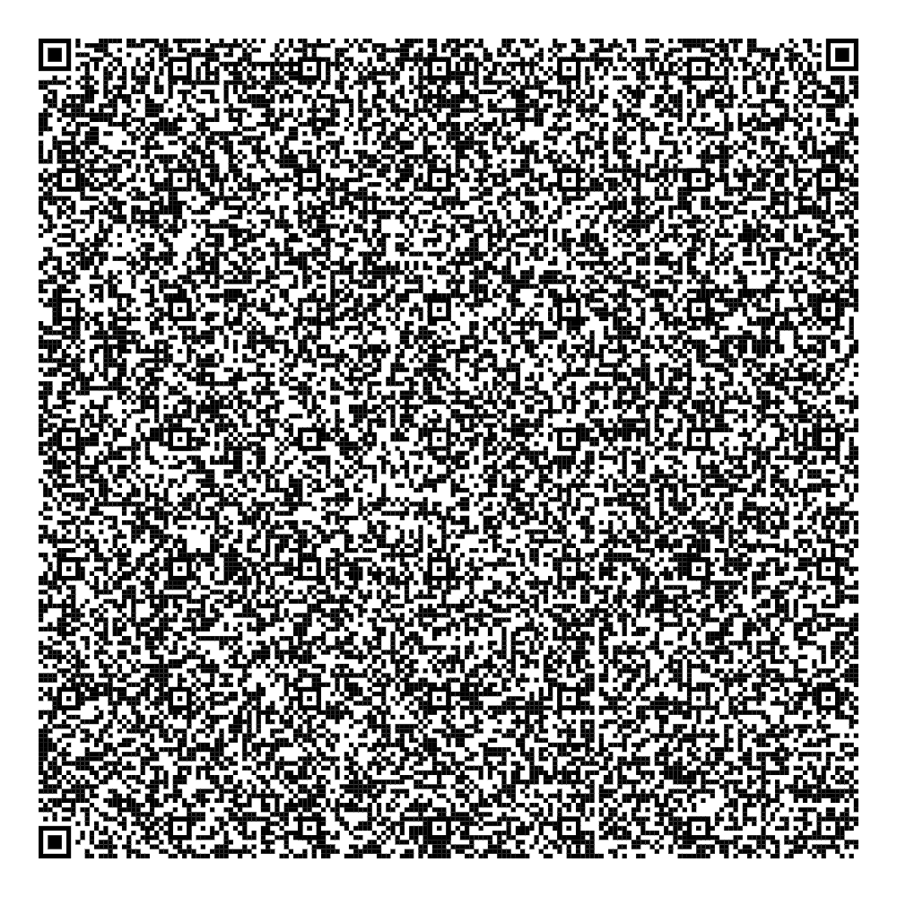

# 🕸️ spiderweb
A tiny HTML5 + CSS + JS demo that fits inside a QR code. Renders a fractal-like pattern using CSS, and plays a chiptune melody via the Web Audio API. The melody was taken from my game, <a href="https://ascpixi.itch.io/expanding-horizons">Expanding Horizons</a>. The <code>spiderweb.min.html</code> file is the one that is encoded into a data URI and encoded into a QR code - <code>spiderweb.html</code> is for development and reference purposes only.

